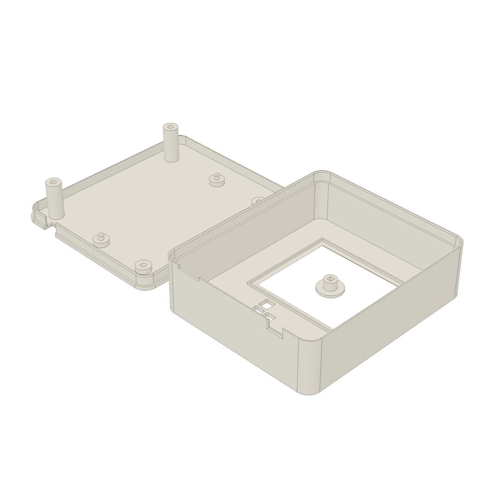
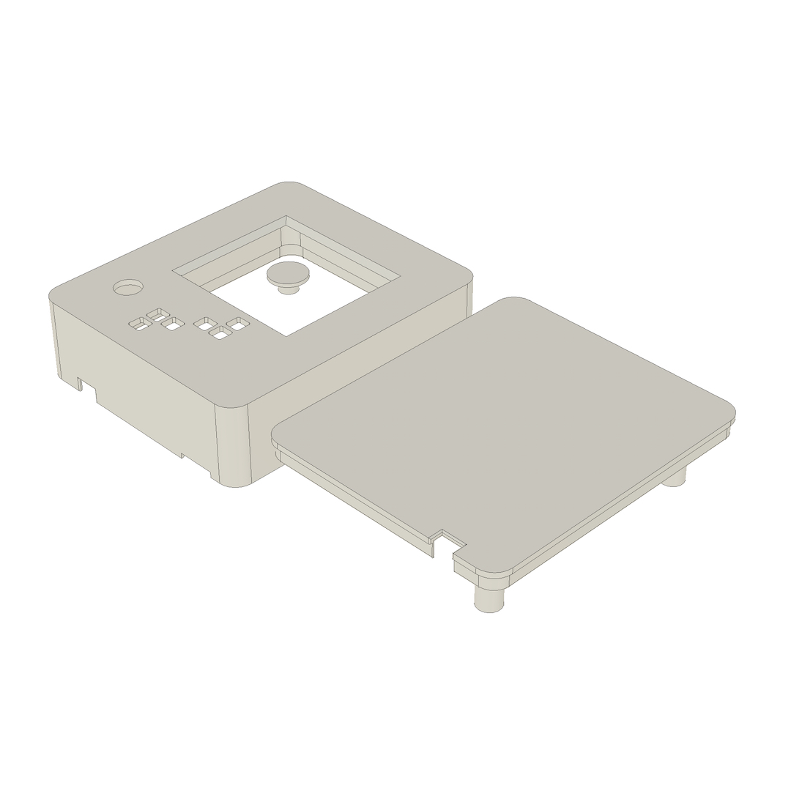
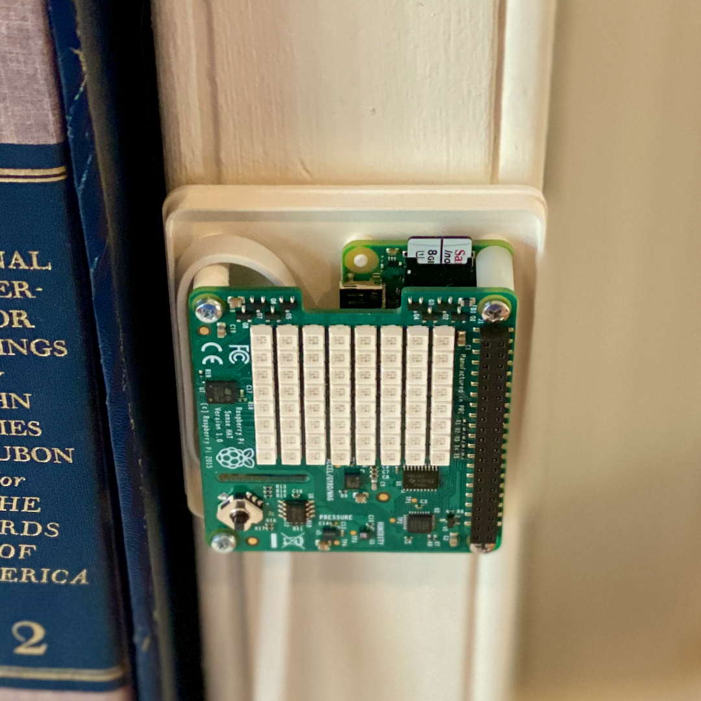
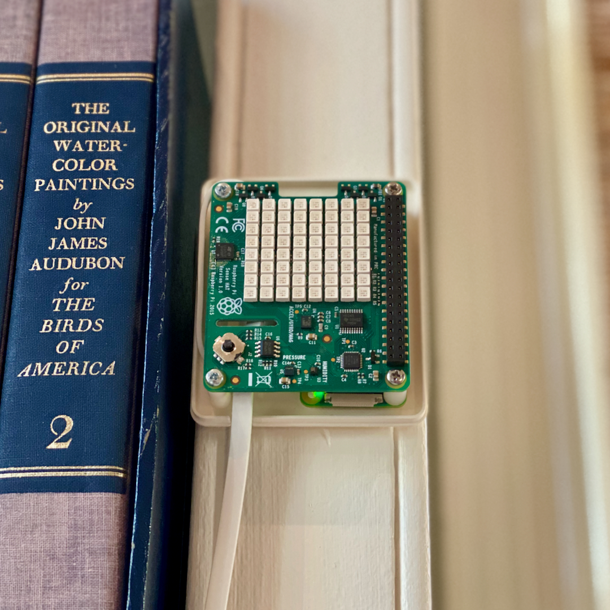
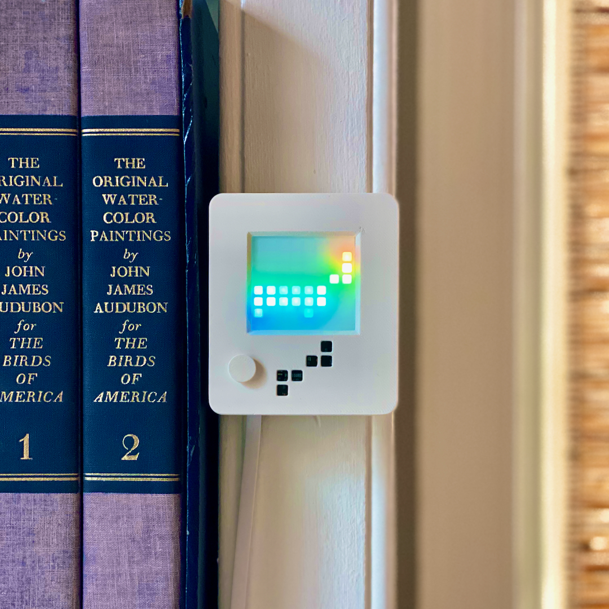

# Building the WindowSense

## Hardware Design

WindowSense runs on a Raspberry Pi Zero WH with a Sense HAT, and both are mounted inside a custom
3D-printed case.  With a minimalist design and printed with Protopasta's Matte Fiber White HTPLA,
the case has an earthy texture that blends in with analog surroundings and decor.

The WindowSense case was designed parametrically in Fusion 360.  The mounting hole dimensions of the Pi Zero and Sense 
HAT were used as fixed construction guidelines around which 
the case is deployed around the electronics as snugly as practicable. 

The two halves of the case snap together with a friction fit as a satisfying click.
A small window in the shape of the WindowSense "logo" allows a peek at the PCBs inside and
the ability to see the Raspberry Pi's power LED.  A decorative joystick cover can be attached to the Sense HAT's five-way joystick button so that it can be operated
through the case.

The internal standoffs have been designed to hold the combined Zero + HAT just right
and allow mounting with just four screws and two spacers. The USB power cable is routed internally to redirect it for a straight exit out the bottom
of the case, which allows for the flat cable to be oriented downward, for wall mounting, or backward, for tabletop use.
An additional slot at the bottom edge makes it easy to pop open the case by inserting a flathead screwdriver
and giving a gentle twist.

## Parts List
[Raspberry Pi Zero WH](https://www.adafruit.com/product/3708)  
[Raspberry Pi Sense HAT](https://www.adafruit.com/product/2738)  
[USB-to-Micro cable](https://www.amazon.com/dp/B07WLRNGZR/ref=cm_sw_em_r_mt_dp_vM6.FbT507SBY?_encoding=UTF8&psc=1)  
[Clear acrylic panel](https://www.homedepot.com/p/OPTIX-8-in-x-10-in-x-0-050-in-Clear-Non-Glare-Acrylic-Sheet-1X09241A/300085223)  
[White vinyl decal](https://www.michaels.com/oracal-631-exhibition-cal-vinyl/M10498459.html?dwvar_M10498459_size=12%22%20x%2012%22&dwvar_M10498459_color=Turquoise)  
M2.5 screws, 15 mm x 2  
M2.5 screws, 5 mm x 2  
Nylon spacers 11 mm x 2  

## 3D Printing the Case

The [STL File on Thingiverse](https://www.thingiverse.com/thing:4724704) contains all three parts of the case: the back plate, 
the front cover, and the joystick handle. It is already laid out for printing on even small printers, and the models 
require no special techniques, settings, or printer hardware to create.  

I printed my case in [Protopasta Matte Fiber HTPLA - White](https://www.proto-pasta.com/collections/all/products/matte-fiber-htpla-white) 
to give the case a natural appearance that doesn't look like plastic.  The design should print well in any PLA filament, however.

## Assembly

### Back plate 
1. Attach the Sense Hat to the Pi Zero header.
2. Place the combined Pi+HAT onto the standoff pegs of the case's back plate.
3. Insert the nylon standoffs between the two PCBs of the Pi and the HAT where they are attached, and then the long screws through all three into the back plate.
4. Insert the short screws through the other two holes of the HAT.
5. Plug in the USB cable and wrap it up around the standoff toward the top of the case and then back down so it can exit the case straight out the bottom.

### Front cover
1. Using a sharp blade, score and then carefully break the 0.050in acrylic panel into a rectangle that is sized to fit snugly inside the small ridge
on the inside of the front cover so that it will be held in the appropriate location to cover the LED matrix.  
2. With the piece of acrylic panel you cut, cut a slightly larger rectangle of the vinyl film.
3. Prepare the plastic panel with a solution of soapy water so that you can reposition and smooth the vinyl when you apply it (it will dry invisibly)
4. Remove the vinyl's backing and apply it carefully to the plastic and then gently smooth out any bubbles using your finger or something with an edge that won't scratch the vinyl, such as a credit card.
5. Once you are happy with the application of the vinyl, trim off any excess around the edges.
6. Place the complete screen, vinyl side in toward the LEDs, into the raised outline which will help keep it in place.  You may want to secure the panel to the front cover with a tiny dot of glue at the corners.

### Putting it all together
1. Snap the back plate and front cover together--they are a friction fit.
2. Place the joystick handle on the tiny joystick nub through the hole on the front of the case.
3. Find a visible place to put the WindowSense on a wall or flat surface.
4. Plug it in and get it running!

  

  

