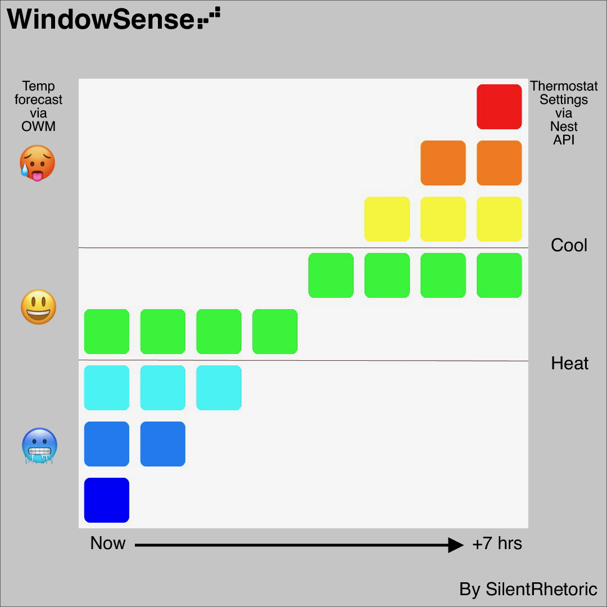

# WindowSense

`"Someone ought to open up a window!"`

Get a sense of when to open your windows for fresh air with WindowSense.
Set your thermostat for comfort and save money on heating and cooling by 
letting in the breeze at the best times.  

WindowSense integrates the temperature forecast with your Nest thermostat
comfort settings to visualize when the outside air will be just right to
throw open the windows for fresh air that won't make your home too hot or cold.

The RGB LED matrix display uses a rainbow of colors to signal what's happening
with the temperature over the next eight hours so you can plan ahead and 
maximize your home's comfort and efficiency.

## The inspiration

There's something special about air that's just the right temperature such that
you can't feel it at all.  Last fall, when the days were still warm and the 
nights were getting cold, my wife and I were trying to open the windows as much as possible
for fresh air. However, as the resident steward of the thermostat, 
I also wanted to make sure we were not letting in hot late-afternoon air that 
would kick on our air conditioning or leaving the windows open too long and 
allowing the house to get too cold from the chilly, nighttime air.  Depending 
on the day, there was sometimes just a narrow window of opportunity to let in 
fresh air that would feel just right and not waste energy.  And so the idea
was born to create a smart device to tell us when it would be comfortable--and efficient--
to throw open the windows for a cross-breeze.

## The WindowSense display

WindowSense uses a stylized graph in a spectrum of colors to show when it will be 
cold, warm, or comfortable outside.  The 8x8 RGB LED matrix represents eight hours
of forecasts with now on the left and the next seven hours from left to right. 

Your thermostat's comfort range, as defined by the heating and cooling setpoint, is represented by 
the middle two rows in green.  Outside temps closer to the top of your comfort range place 
the green square higher; cooler temps closer to the bottom of your comfort range place it lower.

Each row of the graph represents steps of equal size, to give a relative impression of 
how much colder or hotter it is outside than you would want it to be in your home.  If your comfort range
is heat to 65F / cool to 75F, for example, then each block is 5 degrees F.  Additionally, if the forecast will 
be below freezing, the bottom row will turn white to indicate the possibility of snow & ice.

With this information available at a glance, it is easy to know when you can open 
your windows to be comfortable and efficient.  You can also plan for your day, see the ebb
and flow of daily temperatures, and prepare your home or garden if temperatures will drop below freezing.  

## How it works

WindowSense runs as a Python script on an internet-connected Raspberry Pi and helps your keep your home fresh through a few functions:

1. Reading your Nest thermostat's heat & cool setpoints via Google's smart device access API
2. Getting the weather forecast from OpenWeatherMap's API using the pyowm library 
3. Dynamically calculating and drawing a graph that relates the outside temps to
your personal comfort settings
4. Providing temp & humidity readouts, setpoint readouts, brightness adjustments, and 
a way to safely shut down the Raspberry Pi

## What's in this repo

This repository includes the Python script which runs WindowSense, as well as some additional resources, including:

1. "Raspberry Pi Setup" - Guidance for how to set up a fresh Raspberry Pi
2. "Software Installation" - Instructions on how to set up the software and get the script running
3. "Hardware Assembly" - Information on the hardware and 3D-printed case
4. "Learning Resources" - Supplemental learning resources for those interested in learning more about 
the technologies used to create WindowSense

## Thanks and acknowledgments

I want to extend many thanks to the Raspberry Pi Foundation and the countless makers and teachers
who comprise the incredible community around these devices that inspired and helped me to create this project.

#### Disclaimer
This project is in no way associated with Google, Nest, OpenWeatherMap, the Raspberry Pi Foundation, or any other company mentioned in this repository.

